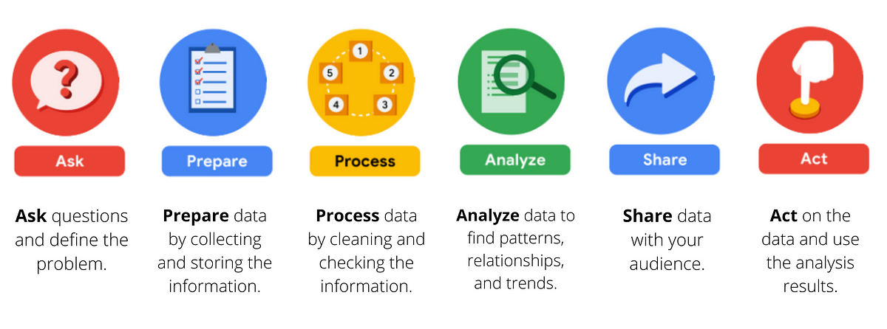

# Bellabeat: How Can a Wellness Technology Company Play It Smart?

This case study is part of the **Google Data Analytics Professional Certificate Capstone Project**.

Author: John Klenn Andrew P. Dungaran \
Date: April 2024

 

# TABLE OF CONTENTS

* [1 Introduction](#Introduction)
    * [1.1 Background](#background)
    * [1.2 Stakeholders and products](#Stakeholders-and-products)

 

# INTRODUCTION

Welcome to the Bellabeat data analysis case study!

In this case study, I will perform real-world tasks of a junior data analyst. In order to answer the key business questions, I will follow the steps of the data analysis process: 

**Ask, Prepare, Process, Analyze, Share, and Act**. 

## Background

I am a junior data analyst working on the **marketing analyst** team at Bellabeat, a high-tech manufacturer of health-focused products for women. Urška Sršen, cofounder and Chief Creative Officer of Bellabeat, believes that analyzing smart device fitness data could help unlock new growth opportunities for the company.

I have been asked to focus on one of Bellabeat’s products and analyze smart device data to gain insight into how consumers are using their smart devices. The insights I discover will then help guide marketing strategy for the company.

## Stakeholders and Products

* **Stakeholders**

    * **Urška Sršen**: Bellabeat’s cofounder and Chief Creative Officer
    * **Sando Mur**: Mathematician and Bellabeat’s cofounder; key member of the Bellabeat executive team
    * **Bellabeat marketing analytics team**: A team of data analysts responsible for collecting, analyzing, and reporting data that helps guide Bellabeat’s marketing strategy.

* **Products**

    * **Bellabeat app**: The Bellabeat app provides users with health data related to their activity, sleep, stress, menstrual cycle, and mindfulness habits. This data can help users better understand their current habits and make healthy decisions. The Bellabeat app connects to their line of smart wellness products.
    * **Leaf**: Bellabeat’s classic wellness tracker can be worn as a bracelet, necklace, or clip. The Leaf tracker connects to the Bellabeat app to track activity, sleep, and stress.
    * **Time**: This wellness watch combines the timeless look of a classic timepiece with smart technology to track user activity, sleep, and stress. The Time watch connects to the Bellabeat app to provide you with insights into your daily wellness.
    * **Spring**: This is a water bottle that tracks daily water intake using smart technology to ensure that you are appropriately hydrated throughout the day. The Spring bottle connects to the Bellabeat app to track your hydration levels.
    * **Bellabeat membership**: Bellabeat also offers a subscription-based membership program for users. Membership gives users 24/7 access to fully personalized guidance on nutrition, activity, sleep, health and beauty, and mindfulness based on their lifestyle and goals.

 
 

# STEP 1: ASK

## 1.1 Business Task

Analyze smart device usage data in order to gain insight into how consumers use non-Bellabeat smart devices. Then, select one Bellabeat product to apply these insights for Bellabeat marketing strategy.

## 1.2 Business Objectives

1. What are the trends identified?
2. How could these trends apply to Bellabeat customers?
3. How could these trends help influence Bellabeat marketing strategy?

## 1.3 Deliverables

1. A clear summary of the business task
2. A description of all data sources used
3. Documentation of any cleaning or manipulation of data
4. A summary of your analysis
5. Supporting visualizations and key findings
6. Your top high-level content recommendations based on your analysis

 
 

# STEP 2: PREPARE

## 2.1 Data Information

* The data was retrieve publicly from Kaggle: [FitBit Fitness Tracker Data](https://www.kaggle.com/datasets/arashnic/fitbit).
* The database is segmented into 18 different csv files with lots of details about the user's behaviour.
* It contains personal fitness tracker from thirty (30) fitbit users who gave their consent.
* The data includes minute-level output for physical activities, heart rate, sleep monitoring, daily activity, and steps.

## 2.2 Data Limitations

* **Small Sample Size**: The sample size of 30 female users is not representative of the entire female population.
* **Outdated**: Data collected from 2016. Daily activities from users may have changed overtime making the data unreliable.
* **Prone to Bias**: The data did not provide demographic information other than that they are all female which could lead to bias or discrepancies in the analysis.

 
 

# STEP 3: PROCESS

The tool which I will be using is Python since it can analyze and at the same time visualize the data.
