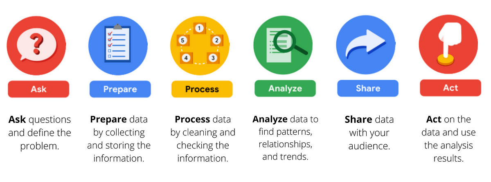

# Google Data Analytics Capstone Case Study: How Can a Wellness Technology Company Play It Smart?

By: John Klenn Andrew P. Dungaran \
Date: April 2024

 

# Table of Contents

 

# Introduction

Welcome to the Bellabeat data analysis case study!

In this case study, I will perform many real-world tasks of a junior data analyst. I will pretend to work for Bellabeat, a high-tech manufacturer of health-focused products for women, and meet different characters and team members. In order to answer the key business questions, I will follow the steps of the data analysis process: ask, prepare, process, analyze, share, and act. 

 

## Scenario

I am a junior data analyst working on the **marketing analyst** team at Bellabeat, a high-tech manufacturer of health-focused products for women. Bellabeat is a successful small company, but they have the potential to become a larger player in the global smart device market. Urška Sršen, cofounder and Chief Creative Officer of Bellabeat, believes that analyzing smart device fitness data could help unlock new growth opportunities for the company. 

I have been asked to focus on one of Bellabeat’s products and analyze smart device data to gain insight into how consumers are using their smart devices. The insights I discover will then help guide marketing strategy for the company. I will present my analysis to the Bellabeat executive team along with my high-level recommendations for Bellabeat’s marketing strategy.

# Ask

